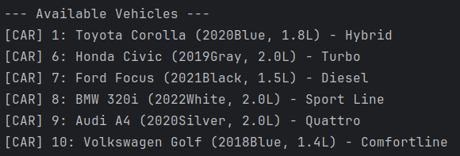

# Kursinio darbo ataskaita  iš objektinio programavimo


# Įvadas

## Apie ką šis projektas?

Tai yra transporto nuomos sistema, parašyta Python kalba, leidžianti ieškoti, nuomoti skirtingų tipų transporto priemones: (automobilius, motociklus, žemės ūkio technika, dviračius).

Sistema palaiko šias funkcijas:
- Transporto priemonių sąrašo įkėlimas
- Nuomos ir grąžinimo logika
- Įrašų saugojimas CSV faile
- Vienetų testavimas

###  Kaip paleisti bei naudotis programą?

1. Įsitikinkite, kad turite **Python 3.x** versiją.
2. Paleiskite `main.py` failą terminale: bash python main.py
3. 
4. Atidarius langą, ekrane pasirodys Transporto nuomos sistema su penkiais galimais pasirinkimais. Norėdami atlikti konkretų veiksmą (pvz., peržiūrėti transporto priemones ar išsinuomoti), įveskite atitinkamą skaičių nuo 1 iki 5 ir paspauskite Enter.

5. **Norėdami pamatyti, kokios transporto priemonės yra galimos nuomai, pirmiausia turite pasirinkti 1 – „Show all vehicles“.** Tik tada galėsite matyti siūlomų automobilių sąrašą ir priimti sprendimą dėl nuomos.
6. 

6. **Kiekvienai transporto priemonei pateikiama ši informacija:  
– **Transporto tipas** (pvz., automobilis, motociklas),  
– **Identifikavimo numeris (ID)** – šio numerio programa prašys, kai norėsite atlikti nuomos ar atšaukimo veiksmą,  
– **Pagaminimo metai**,  
– **Spalva**,  
– **Variklio talpa (litrais)**,  
– **Papildoma informacija** – pavyzdžiui, ar transporto priemonė yra hibridinė, elektrinė ir pan.

Kai kuriais atvejais sistema gali __paprašyti papildomos informacijos__, pavyzdžiui, įvesti savo vardą – tai reikalinga nuomos ar atšaukimo veiksmams atlikti. Tokiu atveju tiesiog įrašykite savo vardą ir tęskite pagal pateiktas instrukcijas.


1. **Trumpas sistemos aprašymas:**
Ši sistema leidžia peržiūrėti visus galimus transporto pasirinkimus, ieškoti konkretaus automobilio pagal ID, išsinuomoti ar atšaukti nuomą bei išeiti iš programos.

2. **Kaip pasirinkti meniu punktą:**
    
	Skaičių reikia įrašyti tiksliai – pvz., norėdami išsinuomoti transporto priemonę, įveskite skaičių 3 ir paspauskite Enter.
    
3. **Ką daryti, jei įvedate neteisingą reikšmę:**
    
	Jei įvesite neteisingą pasirinkimą (pvz., raidę arba skaičių, kurio nėra meniu), sistema parodys klaidos pranešimą ir paprašys įvesti iš naujo.
    
4. **Išsamesnė informacija apie vardo įvedimą:**
    
	Kai kurios funkcijos (pvz., nuoma ar atšaukimas) gali paprašyti įvesti jūsų vardą, kad būtų galima identifikuoti naudotoją. Įrašykite jį tiksliai taip, kaip naudojote anksčiau, kad sistema jus atpažintų.
    
5. **Išėjimo instrukcija:**
    
	Norėdami išeiti iš sistemos, pasirinkite 5. Programa bus uždaryta automatiškai.
    
6. **Patarimas dėl patogumo:**
    
	Naudodami sistemą patogiausia dirbti pilnu ekranu, kad visos instrukcijos būtų aiškiai matomos.
    

# Analizė 
## Darbo įkėlimas naudojant Git ir GitHub

Projektas buvo valdomas naudojant versijų kontrolės sistemą **Git**. Sukūrus vietinę saugyklą, programos failai bei dokumentacija (Markdown formato failas) buvo įkelti į **GitHub** platformą, kuri pasirinkta kaip nuotolinė saugykla darbui pateikti.

Į GitHub buvo įkelti šie failai:

- Programos pirminis kodas,
    
- Aprašomasis failas `README.md`, kuriame pateikta informacija apie programos veikimą, struktūrą bei naudojimo instrukcijos.


Abu failai buvo patalpinti **vienoje bendroje saugykloje**, užtikrinant aiškią struktūrą ir prieinamumą.

## Objektinio programavimo pamatai jų panaudojimas ir paaiškinimas

### Polimorfizmas

**Polimorfizmas** reiškia, kad ta pati metodo antraštė (pvz., `show_info()`) gali būti **įgyvendinta skirtingai** skirtingose klasėse. Tai leidžia įvairiai naudoti tą patį metodą, o elgesys priklauso nuo to, kokios konkrečios klasės objektas tą metodą kviečia.

  	


Programoje naudojamas **polimorfizmas**, kuris leidžia skirtingoms klasėms (`Car` ir `Motorcycle`) įgyvendinti bendrą metodą `show_info()` savaip. Abstraktuota bazinė klasė __Transport__ deklaruoja šį metodą kaip abstraktų, o paveldinčios klasės pateikia savo konkrečią informacijos atvaizdavimo logiką.

Tai leidžia visus transporto priemonių objektus (nesvarbu, ar tai automobilis, ar motociklas) laikyti viename sąraše ir kviesti `show_info()` metodą nežinant konkretaus objekto tipo. Kiekviena klasė pati pasirūpina, kad būtų pateikta jai būdinga informacija.

Pateiktuose ekrano nuotraukose matyti, kaip kiekviena klasė (`Car` ir `Motorcycle`) turi savo `show_info()` metodo versiją, kuri gražiai suformatuoja ir pateikia visą su objektu susijusią informaciją: markę, modelį, metus, spalvą, variklio tūrį bei papildomą informaciją.

## Abstrakcija
### Kas yra abstrakti klasė?
Abstrakti klasė – tai tarsi šablonas būsimiems objektams, kuris apibrėžia, kokie metodai ar savybės privalo būti klasėse, paveldinčiose iš jos. Ji neskirta kurti tiesioginius objektus, o naudojamas kaip pagrindas, pamatas (šablonas), pagal kurį kuriamos konkrečios klasės.

Galima sakyti, kad tai „klasės šablonas“, kuriame suplanuojama, ką turės paveldinčios klasės, tačiau pats abstraktus metodas (pvz., show_info()) dar neturi konkretaus įgyvendinimo.


Paveldėjimo pagalba konkrečios klasės (pvz., Car, Motorcycle) perima bendrus bruožus iš abstrakčios klasės (pvz., Transport) ir pačios įgyvendina trūkstamą logiką – šiuo atveju metodą show_info().

Naudojant @abstractmethod dekoratorių, užtikrinama, kad bazinėje klasėje Transport metodas show_info() neturi konkretaus įgyvendinimo – tai paliekama paveldinčioms klasėms, tokioms kaip Car ar Motorcycle. Kiekviena iš jų pateikia savo informacijos atvaizdavimo logiką, tačiau bendru atveju išlieka vienoda.

Norint naudoti abstrakčias klases ir metodus, programos pradžioje atliekamas reikiamų modulių importas:

from abc import ABC, abstractmethod
Šis importas leidžia paveldėti iš ABC (Abstract Base Class) ir naudoti @abstractmethod žymėjimą.

Šis abstrakcijos principas leidžia:

Sutalpinti bendrą logiką vienoje vietoje, išvengiant pasikartojimo;
Užtikrinti struktūros vientisumą – visos transporto priemonės turės show_info() metodą;Lengvai išplėsti sistemą pridedant naujus transporto tipų klasės (pvz., Truck, Car, neprarandant suderinamumo su jau egzistuojančia logika.
Ekrano nuotraukoje parodyta, kaip sukuriama ši bazinė abstrakti klasė Transport bei abstraktus metodas show_info() – tai esminis žingsnis struktūrizuojant programą pagal OOP principus.

## Paveldėjimas
Paveldėjimas – tai objektinio programavimo principas, leidžiantis vienai klasei (pvz., Car) perimti savybes ir metodus iš kitos – bazinės klasės (pvz., Transport). Taip užtikrinamas kodo pakartotinis naudojimas ir leidžiama išplėsti esamą funkcionalumą, nekuriant visko iš naujo.


Klasė Car paveldi iš abstrakčios bazinės klasės Transport, kuri apibrėžia bendrus visoms transporto priemonėms požymius – tokius kaip id, brand ir model.
Naudojant super().__init__() metodą, paveldimi bendri atributai, o papildomi atributai, tokie kaip year, color, engine_capacity ir extra, pridedami Car klasėje.
Taip užtikrinamas kodo pakartotinio naudojimo principas – bendra logika laikoma bazinėje klasėje, o specifinė informacija aprašoma paveldinčiose klasėse.

## Inkapsuliacija
Inkapsuliacija – tai vidinių objekto duomenų apsaugojimas nuo tiesioginės prieigos iš išorės. Vietoj to siūloma naudoti metodus arba specialius „saugiklius“, kaip @property, kad būtų galima kontroliuoti:


- kaip tie duomenys pasiekiami,
- ar jie gali būti keičiami,
- ar reikalinga papildoma logika (pvz., validacija, logų rašymas ir t. t.).


Metodai kaip:

**_is_vehicle_rented**

**_save_rental_record**

yra inkapsuliacijos pavyzdžiai, ir jų pavadinimai su pabraukimu (_) rodo, kad tai yra "protected" (saugomi, vidaus naudojimui skirti) metodai.

Klasėje naudojami metodai su pavadinimais, prasidedančiais pabraukimu (_), yra skirti vidiniam naudojimui – tai yra inkapsuliacijos požymis.
Tokie metodai, kaip _is_vehicle_rented ir _save_rental_record, slepia sudėtingą ar jautrią logiką nuo išorinio pasaulio, taip apsaugodami objekto būseną bei struktūrą.


Python'e prieigos lygiai nėra griežtai kontroliuojami, tačiau naudojami vardų žymėjimai (naming conventions), kurie padeda atskirti, kaip nariai turėtų būti naudojami:

###  Pavyzdys

```python
class Transport:
    def __init__(self):
        self.public_var = "Visiems prieinama"
        self._protected_var = "Naudoti tik klasėje ar paveldėtojuose"
        self.__private_var = "Paslėpta (name mangling)"
```

| Žymėjimas       | Prieigos lygis | Aprašymas                                                                 |
|------------------|----------------|---------------------------------------------------------------------------|
| `public_var`     | **Public**     | Viešas – gali būti pasiekiamas ir keičiamas iš bet kur.                  |
| `_protected_var` | **Protected**  | Apsaugotas – nenaudoti iš išorės, bet pasiekiamas paveldinose klasėse.  |
| `__private_var`  | **Private**    | Privatus – paslėptas nuo išorinio naudojimo (atliekamas vardų maskavimas). |

